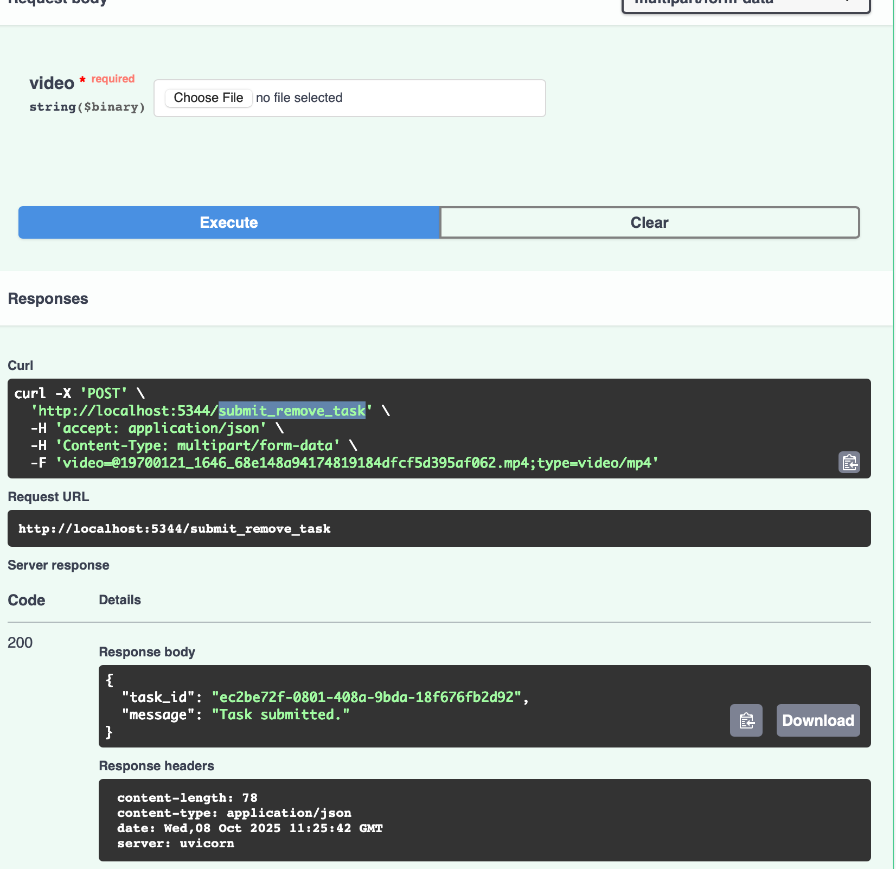

# SoraWatermarkCleaner

[English](README.md) | 中文

这个项目提供了一种优雅的方式来移除 Sora2 生成视频中的 Sora 水印。


- 移除水印后

https://github.com/user-attachments/assets/8cdc075e-7d15-4d04-8fa2-53dd287e5f4c

- 原始视频

https://github.com/user-attachments/assets/3c850ff1-b8e3-41af-a46f-2c734406e77d

⭐️: 

1. **YOLO 权重已更新** — 请尝试新版本的水印检测模型，效果会更好！

2. **数据集已开源** — 我们已经将标注好的数据集上传到了 Hugging Face，查看[此数据集](https://huggingface.co/datasets/LLinked/sora-watermark-dataset)。欢迎训练你自己的检测模型或改进我们的模型！

3. **一键便携版已发布** — [点击这里下载](#3-一键便携版)，Windows 用户无需安装即可使用！


## 1. 方法

SoraWatermarkCleaner（后面我们简称为 `SoraWm`）由两部分组成：

- SoraWaterMarkDetector：我们训练了一个 yolov11s 版本来检测 Sora 水印。（感谢 YOLO！）

- WaterMarkCleaner：我们参考了 IOPaint 的实现，使用 LAMA 模型进行水印移除。

  （此代码库来自 https://github.com/Sanster/IOPaint#，感谢他们的出色工作！）

我们的 SoraWm 完全由深度学习驱动，在许多生成的视频中都能产生良好的效果。


## 2. 安装
视频处理需要 [FFmpeg](https://ffmpeg.org/)，请先安装它。我们强烈推荐使用 `uv` 来安装环境：

1. 安装：

```bash
uv sync
```

> 现在环境将被安装在 `.venv` 目录下，你可以使用以下命令激活环境：
>
> ```bash
> source .venv/bin/activate
> ```

2. 下载预训练模型：

训练好的 YOLO 权重将存储在 `resources` 目录中，文件名为 `best.pt`。它将从 https://github.com/linkedlist771/SoraWatermarkCleaner/releases/download/V0.0.1/best.pt 自动下载。`Lama` 模型从 https://github.com/Sanster/models/releases/download/add_big_lama/big-lama.pt 下载，并将存储在 torch 缓存目录中。两者都是自动下载的，如果失败，请检查你的网络状态。

## 3. 一键便携版

对于不想手动安装的用户，我们提供了**一键便携版本**，包含所有预配置的依赖项，开箱即用。

### 下载链接

**Google Drive（谷歌云盘）：**
- [从 Google Drive 下载](https://drive.google.com/file/d/1ujH28aHaCXGgB146g6kyfz3Qxd-wHR1c/view?usp=share_link)

**百度网盘（推荐国内用户使用）：**
- 链接：https://pan.baidu.com/s/1i4exYsPvXv0evnGs5MWcYA?pwd=3jr6
- 提取码：`3jr6`

### 特点
- ✅ 无需安装
- ✅ 包含所有依赖
- ✅ 预配置环境
- ✅ 开箱即用

只需下载、解压并运行！

## 4. 演示

基本用法，只需尝试 `example.py`：

```python

from pathlib import Path
from sorawm.core import SoraWM


if __name__ == "__main__":
    input_video_path = Path(
        "resources/dog_vs_sam.mp4"
    )
    output_video_path = Path("outputs/sora_watermark_removed.mp4")
    sora_wm = SoraWM()
    sora_wm.run(input_video_path, output_video_path)

```

我们还提供了基于 `streamlit` 的交互式网页界面，使用以下命令尝试：

```bash
streamlit run app.py
```


## 5. WebServer

在这里，我们提供了一个基于 FastAPI 的 Web 服务器，可以快速将这个水印清除器转换为服务。

只需运行：

```python
python start_server.py
```

Web 服务器将在端口 `5344` 启动，你可以查看 FastAPI [文档](http://localhost:5344/docs) 了解详情，有三个路由：

1. submit_remove_task:

   > 上传视频后，会返回一个任务 ID，该视频将立即被处理。

   

2. get_results:

你可以使用上面的任务 ID 检索任务状态，它会显示视频处理的百分比。一旦完成，返回的数据中会有下载 URL。

3. downlaod:

你可以使用第2步中的下载 URL 来获取清理后的视频。

## 6. 数据集

我们已经将标注好的数据集上传到了 Hugging Face，请查看 https://huggingface.co/datasets/LLinked/sora-watermark-dataset。欢迎训练你自己的检测模型或改进我们的模型！


## 7. API

打包为 Cog 并[发布到 Replicate](https://replicate.com/uglyrobot/sora2-watermark-remover)，便于基于 API 的简单使用。

## 8. 许可证

Apache License


## 9. 引用

如果你使用了这个项目，请引用：

```bibtex
@misc{sorawatermarkcleaner2025,
  author = {linkedlist771},
  title = {SoraWatermarkCleaner},
  year = {2025},
  url = {https://github.com/linkedlist771/SoraWatermarkCleaner}
}
```

## 10. 致谢

- [IOPaint](https://github.com/Sanster/IOPaint) 提供的 LAMA 实现
- [Ultralytics YOLO](https://github.com/ultralytics/ultralytics) 提供的目标检测
